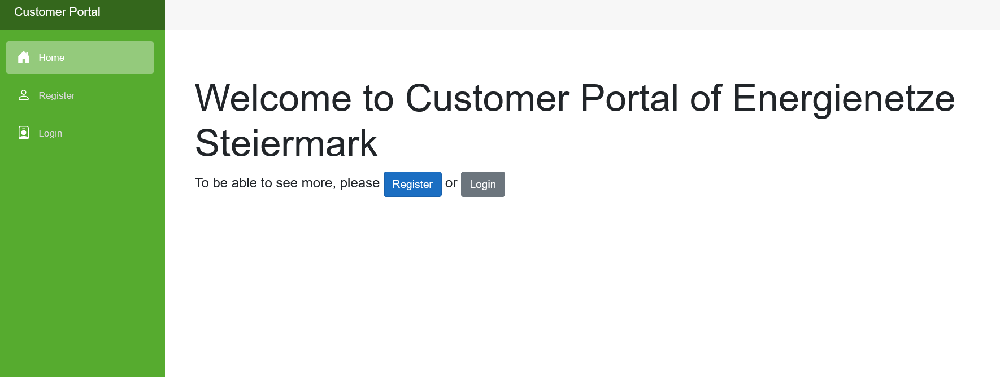

# Introduction 
This project focuses on creating a customer portal for EV charging stations using the Blazor/.NET framework.
- the user can register, login, and logout
- view his charging stations and his charging points.
- the user can also view his charging cards and his charging processes.
- the user can also manage his profile account


### Prerequisites

Before you start, ensure you have the following installed:
- .NET 8.0 SDK or higher: [Download here](https://dotnet.microsoft.com/download)
- Visual Studio 2022 or later (optional, but recommended): Make sure to include the ASP.NET and web development workload. [Download here](https://visualstudio.microsoft.com/de/downloads/)

# Getting Started

This guide will help you set up the EV charging station customer portal on your system. Follow the steps below to install the software, manage dependencies, and use the latest version of our project.

## Installation Process

1. **Clone the Repository**: First, clone the project repository to your local machine using Git:

   ```bash
   git clone https://github.com/AbdullahKaitoua/fhj-est-customer-portal-2.git 
2. **Navigate to the Project Directory**: Change into the project directory:

   ```bash
   cd fhj-est-customer-portal-2
3. **Install Dependencies**: Use the .NET CLI to restore and install the required packages:

   ```bash
   dotnet restore
4. **Build**: Use the .NET CLI to build and test the project:

   ```bash
   dotnet build
5. **Run the Application**: Use the .NET CLI to run the application:

   ```bash
   dotnet run
6. **Open the Application**: Open your web browser and navigate to the following URL:

   ```bash
   https://localhost:7166


# Database Connection
you need to ask the developer for the database to be able to run the application successfully.

# Example

Here is an example of the dashboard page of the application after you run it.



after you register and login you can view your charging stations and charging points.


# Questions?

If you have any questions about contributing, please feel free to contact me directly or open an issue.

Thank you for considering contributing to the EV Charging Station Customer Portal. Your support helps us build a better product for everyone!